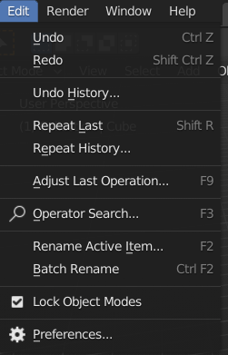
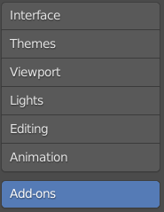
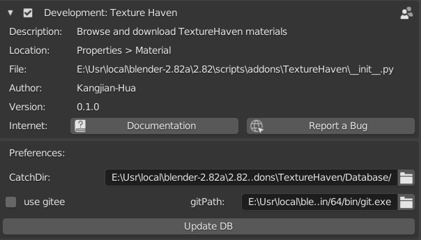

# Texture Haven for Blender addon

## Required

Blender >= 2.8

## Abstract

It is blender 2.8 addon, which is currently only applicable to windows 64 bit operating system. 

The addon can query [TextureHaven's](https://texturehaven.com/textures/) texture map directly in blender, download the map and build the material.

## Instructions

### Install

1. Open Blender
2. Open Preferences window. (From header: Edit->Preference)

3. Click "Add-ons":

4. Click "Install" Button:

5. Search the zip file downloaded from https://github.com/HakimHua/TextureHavenForBlender

6. Enable Texture Haven

### Usage

Before using this add-on, you need to configure some options:

The "Catchpath" is the cache path of texture haven,  where all thumbnails and downloaded textures will be saved. 

Chebox "use gitee" is to select the thumbnail database address. If it is not selected, the thumbnail will be downloaded from https://github.com/HakimHua/TextureHavenSpider, otherwise it will be downloaded from https://gitee.com/Huakim/TextureHavenSpider.

This add-on uses git software to download database. You need to specify the executable path of git from "gitPath".

Finally, use the "Update DB" buttons to update the database (mainly the thumbnails).

After enabling the add-on, you can find Texture Haven from "Properties-Material":

Choose your favorite material and click "Download Texture". button

When the download is complete, the "Build Material" button appears under the download button. 

After the building is complete, you can find the constructed material in the material slot:

Assign a material. and it will be displayed by the corresponding object.